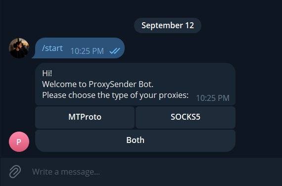
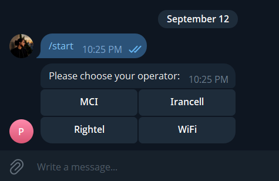
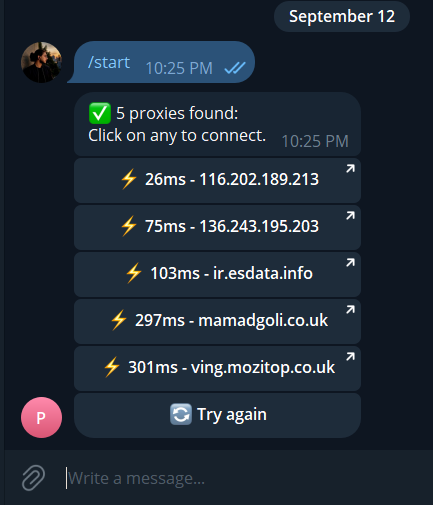

# 🔌 ProxySender Bot

A Telegram bot that automatically discovers MTProto/SOCKS5 proxies from public Telegram channels, tests them for latency, and serves the fastest active ones to users through a simple inline-button interface — no manual proxy hunting required.

<p align="center">
  
  
  
</p>

---

## ✨ Features

- **Automatic proxy discovery** — scrapes public Telegram channel previews (`t.me/s/<channel>`) for `tg://proxy` and `t.me/proxy` links, no login or API credentials required.
- **Live health checking** — tests every proxy's TCP reachability and measures latency in parallel using a thread pool, deactivating proxies that fail repeatedly.
- **Operator-aware filtering** — detects which mobile operator (MCI / Irancell / Rightel / Wi-Fi) a proxy is intended for based on the channel post's text, and falls back gracefully when unknown.
- **Simple bot UX** — inline-button flow: pick proxy type → pick operator → get a ranked list of the fastest working proxies, one tap to connect.
- **Self-healing background worker** — re-scrapes channels and re-tests all active proxies on a fixed interval, automatically reconnects if network/polling drops.
- **Zero external infrastructure** — everything runs from a single Python process with a local SQLite database; no paid API, no cloud dependency.

## 🧠 How It Works

```
┌─────────────────┐     scrape      ┌──────────────┐     store     ┌──────────┐
│ Public Telegram  │ ───────────────▶│  extractor.py │──────────────▶│  SQLite  │
│    channels       │                │ (regex + HTML │               │ database │
└─────────────────┘                 │   unescaping) │               └────┬─────┘
                                     └──────────────┘                    │
                                                                          │ test
┌─────────────────┐    inline UI    ┌──────────────┐     query          ▼
│   Telegram user   │◀───────────────│   main.py    │◀──────────┌──────────────┐
│                   │───────────────▶│ (pyTelegram- │           │  checker.py   │
└─────────────────┘   /start, taps  │   BotAPI)    │           │ (TCP ping via │
                                     └──────────────┘           │ ThreadPool)   │
                                                                 └──────────────┘
```

1. **Extractor** periodically fetches the public preview page of each configured channel (no MTProto login needed — just plain HTTP), pulls out proxy links with regex, and detects the intended operator from the surrounding message text.
2. **Checker** opens a raw TCP connection to every active proxy's `server:port` in parallel (via `ThreadPoolExecutor`) to measure latency and mark dead proxies inactive after repeated failures.
3. **Bot** presents users with a type → operator selection flow and returns the top N fastest proxies matching their choice, straight from the database.
4. A background thread repeats steps 1–2 every 30 minutes so the pool of proxies stays fresh without any manual intervention.

## 📦 Requirements

- Python 3.11+
- A Telegram bot token (from [@BotFather](https://t.me/BotFather))

## 🚀 Installation

```bash
git clone https://github.com/<your-username>/proxy-sender-bot.git
cd proxy-sender-bot

python -m venv venv
source venv/bin/activate      # Windows: venv\Scripts\activate

pip install -r requirements.txt
```

## ⚙️ Configuration

Copy the example environment file and fill in your own values:

```bash
cp .env.example .env
```

```env
BOT_TOKEN=your_bot_token_from_botfather
PROXY_CHANNELS=channel_one,channel_two,channel_three
```

| Variable | Description |
|---|---|
| `BOT_TOKEN` | Bot token obtained from BotFather. |
| `PROXY_CHANNELS` | Comma-separated list of **public** Telegram channel usernames (without `@`) to scrape for proxies. |

> ⚠️ Never commit your real `.env` file. It's already listed in `.gitignore`.

## ▶️ Usage

```bash
python main.py
```

On startup, the bot:
1. Initializes the local SQLite database (`proxies.db`) if it doesn't exist.
2. Runs an initial scrape + health-check cycle.
3. Starts a background thread that repeats this cycle every 30 minutes.
4. Begins polling Telegram for user messages.

Then, in Telegram, send `/start` to the bot and follow the buttons:

```
/start → [MTProto | SOCKS5 | Both] → [MCI | Irancell | Rightel | WiFi] → 📋 list of proxies
```

## 🗂️ Project Structure

```
proxy-sender-bot/
├── main.py          # Bot entrypoint, inline keyboard flow, background worker
├── extractor.py      # Scrapes public channels and parses proxy links
├── checker.py        # Parallel TCP latency testing for stored proxies
├── database.py        # SQLite access layer (CRUD for proxies table)
├── .env.example       # Template for required environment variables
├── requirements.txt   # Python dependencies
└── README.md
```

## 🧩 Database Schema

| Column | Type | Description |
|---|---|---|
| `id` | INTEGER | Primary key |
| `proxy_url` | TEXT | Full proxy link (unique) |
| `proxy_type` | TEXT | `mtproto` or `socks5` |
| `server` | TEXT | Proxy host |
| `port` | INTEGER | Proxy port |
| `operator` | TEXT | Detected mobile operator, or `unknown` |
| `ping_ms` | INTEGER | Last measured latency |
| `is_active` | BOOLEAN | Whether the proxy currently passes health checks |
| `fail_count` | INTEGER | Consecutive failed checks (deactivated after 3) |
| `last_checked` | TEXT | Timestamp of the last health check |
| `created_at` | TEXT | Timestamp the proxy was first discovered |

## 🛠️ Tech Stack

- **[pyTelegramBotAPI](https://github.com/eternnoir/pyTelegramBotAPI)** — Bot API wrapper for the user-facing interface.
- **`requests`** — fetches public channel preview pages over plain HTTP.
- **`sqlite3`** (standard library) — lightweight, file-based persistence.
- **`concurrent.futures.ThreadPoolExecutor`** — parallel proxy latency testing.
- **`python-dotenv`** — environment variable management.

## 📝 Notes & Lessons Learned

- Public channel preview pages (`t.me/s/<channel>`) don't require any login, `api_id`, or `api_hash` — a major simplification over using an MTProto client library, at the cost of only being able to read **public** channels' recent history.
- Some channels double-encode HTML entities in their post content (`&amp;amp;` instead of `&amp;`), so proxy links need to be recursively unescaped rather than unescaped just once.
- TCP-level reachability checks confirm a proxy's port is open and measure round-trip time, but do not validate the full MTProto handshake — good enough for ranking proxies by responsiveness, not a substitute for a full protocol-level test.

## 🗺️ Roadmap / Ideas for Future Improvements

- [ ] Full MTProto handshake validation instead of a plain TCP connect check.
- [ ] `/stats` command showing counts of active proxies per operator.
- [ ] Dockerfile + `docker-compose.yml` for one-command deployment.
- [ ] Unit tests for the regex-based proxy extraction logic.
- [ ] Structured logging instead of `print()` statements.

## 📄 License

This project is licensed under the MIT License — see the [LICENSE](LICENSE) file for details.

## ⚠️ Disclaimer

This bot only aggregates and redistributes publicly available MTProto/SOCKS5 proxy links that are already posted openly in public Telegram channels. It does not host, operate, or control any of the proxy servers themselves.

## 📸 Screenshots

<p align="center">
  
  
  
</p>
